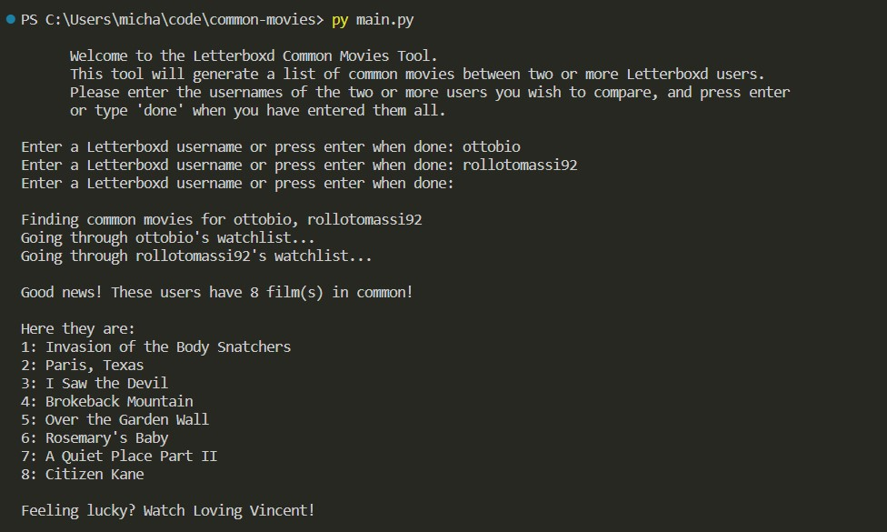

# Letterboxd Common Movies

This program is forked from https://github.com/owenhalpert/common-movies and uses an OOP approach with urllib3.

The program will compare your watchlist with another user's and list common films. It will also pick a random movie for you from the users watchlists.

## Setup

1. Download or pull the project.
2. Use the `pip install -r requirements.txt` command to install all of the Python modules and packages listed in the requirements.txt file.
3. Run `python main.py` in your terminal. You will be prompted for both users' Letterboxd usernames.

## Successful Execution

